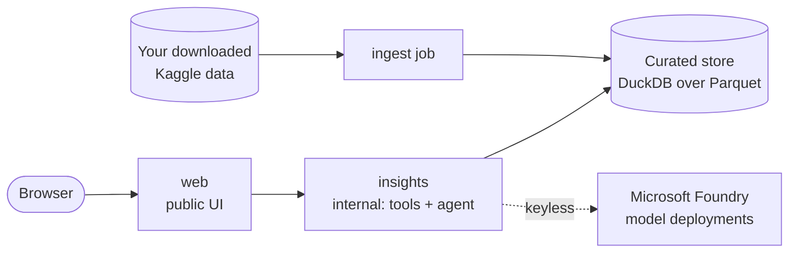

# Football insights: 150 years of international football, on AKS and ACA

What can more than 150 years of international football tell us, and what does it take to ship those insights as an AI app on Azure Kubernetes Service (AKS) and on Azure Container Apps (ACA)?

This repository is the companion to the Microsoft Reactor livestream **Build AI-powered soccer insights apps with AKS and ACA**. (The title says soccer; the app and the data say football.) It answers seven questions about men's international football since 1872:

1. Who is the best team of all time?
2. Which teams dominated different eras of football?
3. What trends have there been in international football throughout the ages: home advantage, total goals scored, distribution of teams' strength?
4. Can we say anything about geopolitics from football fixtures: how has the number of countries changed, which teams like to play each other?
5. Which countries host the most matches in which they themselves are not participating?
6. How much, if at all, does hosting a major tournament help a country's chances in the tournament?
7. Which teams are the most active in playing friendlies and friendly tournaments, and does it help or hurt them?

## Data attribution

- **International football results from 1872 to 2026** by Mart Jürisoo, on [Kaggle](https://www.kaggle.com/datasets/martj42/international-football-results-from-1872-to-2017), CC0: Public Domain.
- **Global Development Data (1960–2025)** by Yogesh Mishra, on [Kaggle](https://www.kaggle.com/datasets/yogeshm01/global-development-data-19602025), from the World Bank's World Development Indicators, CC BY 4.0. This app reshapes and filters the data.

The data is not redistributed here. See [data/README.md](data/README.md) for versions and licenses.

## How it works

- **Deterministic analytics own every number.** Tested Python and SQL over a curated copy of the data compute every figure, chart, and table.
- **AI explains.** A Microsoft Foundry model reads a question, calls the analytics tools, and explains their results. A grounding check rejects any number the model writes that the tools didn't return.
- **One set of images, two platforms.** The same container images run locally with Docker Compose, on AKS, and on ACA.



Methods, coverage, and caveats for every question: [docs/METHODS.md](docs/METHODS.md).

## Quick start

1. Install Python 3.12, Docker Desktop, and Git.
2. Clone this repository.
3. Download the data yourself: [data/README.md](data/README.md). The repository contains no data.
4. From the repository root:

   ```powershell
   ./demo/scripts/demo.ps1 bootstrap
   ./demo/scripts/demo.ps1 verify
   ./demo/scripts/demo.ps1 up
   ```

   In bash, use `./demo/scripts/demo.sh` with the same commands.

5. Open <http://127.0.0.1:8080>.

Details: [docs/SETUP.md](docs/SETUP.md).

## Deploy to AKS and ACA

The same images deploy to Azure Kubernetes Service and to Azure Container Apps with Bicep and the Azure CLI. Everything authenticates with Microsoft Entra ID; there are no keys. Fill in your names in `.env`, then run the steps in [docs/DEPLOYMENT.md](docs/DEPLOYMENT.md):

```powershell
./demo/scripts/demo.ps1 azure-foundation   # Foundry with the model deployments, monitoring, a budget
./demo/scripts/demo.ps1 azure-platform     # registry, private storage, per-service identities
./demo/scripts/demo.ps1 upload-data
./demo/scripts/demo.ps1 build-push
./demo/scripts/demo.ps1 aks-deploy         # and/or aca-deploy
./demo/scripts/demo.ps1 smoke
```

Which platform should you choose? [docs/AKS-VS-ACA.md](docs/AKS-VS-ACA.md) compares them, and `demo teardown` removes everything when you're done.

## Documentation

| Document | What's in it |
| --- | --- |
| [docs/ARCHITECTURE.md](docs/ARCHITECTURE.md) | Components, request and data flows, identity, telemetry |
| [docs/METHODS.md](docs/METHODS.md) | Definitions, methods, coverage, and caveats for every question; grounding and evaluation |
| [docs/SETUP.md](docs/SETUP.md) | Run it on your machine |
| [docs/DEPLOYMENT.md](docs/DEPLOYMENT.md) | Deploy to AKS and ACA, operate, and tear down |
| [docs/AKS-VS-ACA.md](docs/AKS-VS-ACA.md) | The side-by-side comparison and a guide to choosing |
| [docs/HACKATHON-GUIDE.md](docs/HACKATHON-GUIDE.md) | Add a question, bring your own data, swap the model, ideas |
| [docs/RUNBOOK.md](docs/RUNBOOK.md) and [docs/ONSTAGE-SCRIPT.md](docs/ONSTAGE-SCRIPT.md) | How the livestream demo runs, minute by minute |
| [docs/APPENDIX.md](docs/APPENDIX.md) | Design choices, common questions, and dated sources |
| [data/README.md](data/README.md) | Download and verify the data |

## Contributing

See [CONTRIBUTING.md](CONTRIBUTING.md), [CODE_OF_CONDUCT.md](CODE_OF_CONDUCT.md), and [SECURITY.md](SECURITY.md). The code is released under the [MIT License](LICENSE).

