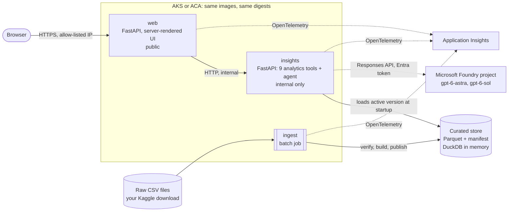
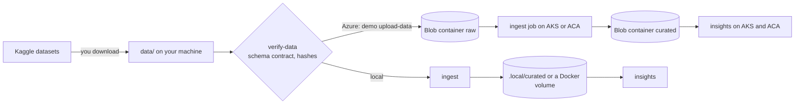
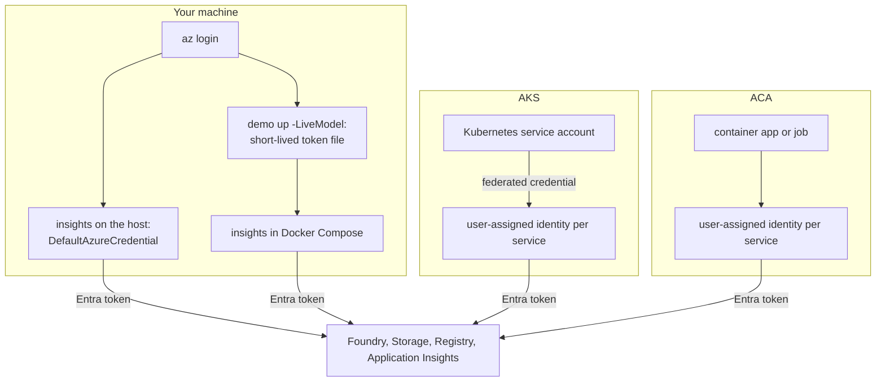
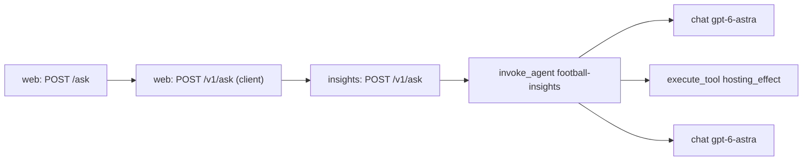

# Architecture

One set of container images, three services, and two Azure platforms. This page shows how a question becomes a grounded answer, how data gets from your download to the services, how every component authenticates without keys, and how you can follow one request end to end.

## Components



| Component | What it does | Where it runs | Reachable from |
| --- | --- | --- | --- |
| `web` | Renders the pages (insight cards with a selector for each question's other views, the question box, the Data page, and the trace view) and a small JSON API: `POST /api/ask` and `GET /api/cards`. Sets security headers and per-client rate limits. Holds no data. | Container, port 8080 | The internet, restricted to allow-listed addresses |
| `insights` | Loads the curated store, runs the deterministic analytics tools, and hosts the insights agent that calls Microsoft Foundry. | Container, port 8081 | Only `web` |
| `ingest` | Verifies the raw files against the data contract, builds a versioned curated store and a data-quality report, and switches the active version atomically. | Job: Docker Compose service, Kubernetes Job, or Container Apps job | Nothing; it runs to completion |
| Curated store | Parquet tables, a manifest with checksums, and the data-quality report, under a content-addressed version such as `cv-1a2b3c4d5e6f`. `insights` queries it with DuckDB in memory. | A local folder or a private blob container | `insights` (read) and `ingest` (write) |
| Microsoft Foundry | One Foundry resource with a project and two model deployments. Which deployment serves answers is one setting, `AI_MODEL_DEPLOYMENT`. | Azure | `insights` and the operator, with Microsoft Entra tokens only |
| Application Insights | One resource for both platforms; the platform is a dimension on every span. | Azure | All three services, with Entra tokens only |

The images contain code only. Locally, Docker Compose mounts your `data/` folder read-only into `ingest` and keeps the curated store in a Docker volume. In Azure, both platforms read the same curated version from the same private storage account.

Code: `demo/src/football_insights/` (`web/`, `insights/`, `ingest/`, `analytics/`, `agent/`). Deployment definitions: `demo/docker/`, `demo/k8s/`, `demo/infra/`.

## Deterministic numbers, AI explanations

The boundary is strict and enforced in code:

| Deterministic (tested Python and SQL) | AI (Microsoft Foundry model) |
| --- | --- |
| Every number, table, chart, and chart summary | Chooses which tools to call, with which parameters |
| Evidence IDs, coverage notes, and caveats | Writes a short narrative from the tool results |
| Minimum sample sizes and uncertainty intervals | Says when a question is outside the data, and what data would be needed |
| The grounding check on every narrative | Nothing else: it has no write, admin, shell, SQL, or network tools |

The agent can call nine read-only tools with strict JSON schemas: `best_team`, `era_leaders`, `trends`, `geopolitics`, `neutral_hosts`, `hosting_effect`, and `friendlies` (one per question), plus `data_limits` and `dataset_facts` for scope questions. Each returns aggregates, never raw rows, with evidence IDs, the method version, the dataset version, coverage, and caveats. `GET /v1/tools` on `insights` lists their schemas. Methods: [METHODS.md](METHODS.md).

## Request flow: from question to grounded answer

```mermaid
sequenceDiagram
  autonumber
  participant B as Browser
  participant W as web
  participant I as insights (agent)
  participant T as analytics tools
  participant F as Foundry deployment
  B->>W: POST /ask (question, at most 300 characters)
  W->>I: POST /v1/ask (W3C traceparent)
  I->>F: responses.create(instructions, question, 9 tool schemas)
  F-->>I: function calls, for example hosting_effect(view="2026")
  I->>T: execute_tool (read-only, bounded)
  T-->>I: facts with evidence IDs, chart, caveats
  I->>F: tool results
  F-->>I: JSON {narrative, key_evidence_ids, in_scope}
  I->>I: grounding check: every number must match a tool value
  alt a number is not in the tool results
    I->>F: one retry, listing the ungrounded numbers
    I->>I: check again; if it still fails, hide the narrative
  end
  I-->>W: answer: narrative or notice, evidence, chart, caveats, model, tokens, latency
  W-->>B: page with the environment badge and a copyable trace ID
```

- **Bounds.** At most 6 tool calls per answer, 1,200 output tokens, 45 seconds, and 300-character questions. `store` is off, so Foundry keeps no conversation state.
- **Grounding.** A deterministic validator extracts every number in the narrative and accepts it only if a tool returned the same value at the precision written. Numbers typed in the question itself are exempt. After one failed retry, the page shows the deterministic evidence with a notice instead of the narrative. An answer that called no tool is hidden too.
- **Honest limits.** Out-of-scope questions, such as club football, women's internationals, tactics, player statistics beyond goals, or predictions, get an explanation of what the data can't answer and what would be needed.
- **When the model isn't live.** Cards and evidence still render. The narrative area says the AI narrative is unavailable, or shows a cached narrative labeled with when and how it was generated. The badge and the telemetry always say whether an answer was live.

The page the browser receives builds its chart from tool data, never from model text. Code: `agent/loop.py`, `agent/grounding.py`, `agent/instructions.py`.

## Data flow



1. You download the two datasets from Kaggle into `data/` ([data/README.md](../data/README.md)). The repository contains no data.
2. `verify-data` checks files, columns, types, encoding, row-count ranges, and date ranges against the contract in `demo/src/football_insights/data/contract.py`. Schema drift fails; a newer dataset version only warns.
3. `ingest` reshapes and joins the files with the reviewed reference lists in `demo/src/football_insights/reference/` (crosswalk, tournaments, eras, lineage), writes Parquet tables, a manifest with SHA-256 checksums, and a data-quality report, and then switches `ACTIVE.json` to the new version.
4. The version name is a hash of the inputs, the reference lists, the development-indicator shortlist, and the ingest version, so running `ingest` again on the same inputs reuses the same version with identical checksums. The AKS Job and the ACA job can both run without conflicting.
5. `insights` loads the active version at startup and retries every 15 seconds until one exists. After publishing a new version, restart `insights` to load it.

## Identity: keyless everywhere



- **Local.** Code run on your machine uses your own Azure CLI sign-in. Containers can't reuse it, so `demo up -LiveModel` writes a short-lived access token for `insights` to a git-ignored file and refreshes it every 15 minutes; `demo down` deletes it.
- **AKS.** Microsoft Entra Workload ID: each service account is annotated with its identity's client ID, and a federated credential trusts the cluster's OIDC issuer for exactly that service account. The kubelet identity pulls images.
- **ACA.** Each app and the job run with their own user-assigned identity, which also pulls images.
- **Nothing to leak.** Key-based authentication is disabled on the Foundry resource, the storage account, and Application Insights; the registry admin user is disabled. There is no API-key setting in the code.

Each service gets its own identity on each platform, with only the roles it needs:

| Identity | Roles | Scope |
| --- | --- | --- |
| `web` | Monitoring Metrics Publisher; AcrPull (ACA only) | Application Insights; registry |
| `insights` | Foundry User; Storage Blob Data Reader; Monitoring Metrics Publisher; AcrPull (ACA only) | Foundry resource; `curated` container; Application Insights; registry |
| `ingest` | Storage Blob Data Reader; Storage Blob Data Contributor; Monitoring Metrics Publisher; AcrPull (ACA only) | `raw` container; `curated` container; Application Insights; registry |
| AKS kubelet | AcrPull | Registry |
| Operator (you) | Foundry User; Monitoring Metrics Publisher; Storage Blob Data Contributor; Azure Kubernetes Service RBAC Cluster Admin | Foundry resource; Application Insights; `raw` container; the AKS cluster |

Definitions: `demo/infra/foundation.bicep`, `platform.bicep`, and `aks.bicep`.

## Networking

- **Local.** Only `web` publishes a port, bound to `127.0.0.1:8080`.
- **AKS.** `web` is exposed through a Gateway API `Gateway` (application routing, class `approuting-istio`) and an `HTTPRoute`. `insights` is a `ClusterIP` Service, and a network policy admits only `web` pods on its port.
- **ACA.** `web` has external ingress; `insights` has internal-only ingress, reachable only inside the environment.
- **Allow-list.** Each public endpoint accepts only the addresses in `ALLOWED_CIDRS`, through each platform's own mechanism: ACA ingress IP restrictions, and on AKS a Gateway infrastructure annotation that the Azure load balancer enforces. [AKS-VS-ACA.md](AKS-VS-ACA.md) compares them.

## Telemetry



- **Tracing.** OpenTelemetry with W3C trace-context propagation from `web` through `insights` to each model call. Model and tool spans follow the OpenTelemetry generative AI semantic conventions (`gen_ai.operation.name`, `gen_ai.request.model`, `gen_ai.usage.input_tokens`, `gen_ai.tool.name`, and so on), which are still marked experimental upstream.
- **App attributes.** Every span carries `app.platform`, `cloud.region`, and `app.image_digest`. Tool spans add evidence IDs, row counts, the method version, and the dataset version. Agent spans add the narrative status, the grounding result, token usage, and the estimated cost.
- **Privacy.** Prompts and model responses are not logged, and nothing logs secrets.
- **Where it goes.** In Azure, all three services export to one Application Insights resource through the Azure Monitor OpenTelemetry distro, authenticated with Entra ID; `cloud_RoleName` is the service. Ready-made KQL: `demo/observability/queries.kql`.
- **Immediate view.** Every page shows a trace ID. `/trace/<id>` renders the spans that `web` and `insights` hold in memory for that request, so you can inspect a request immediately even when cloud ingestion lags by minutes. Local runs also write spans to `.local/traces/*.jsonl`.
